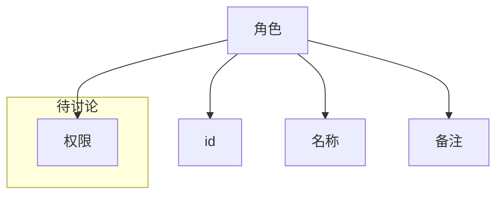
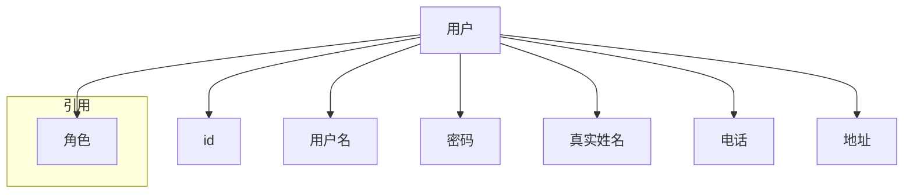
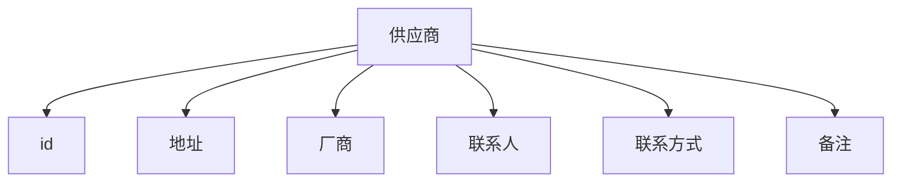
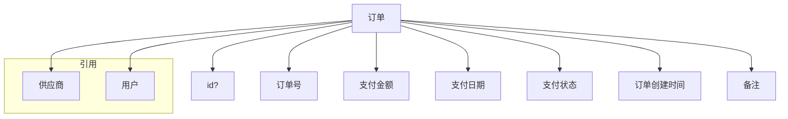
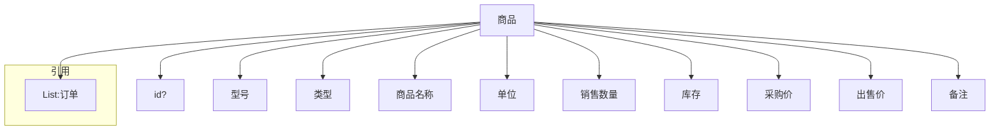
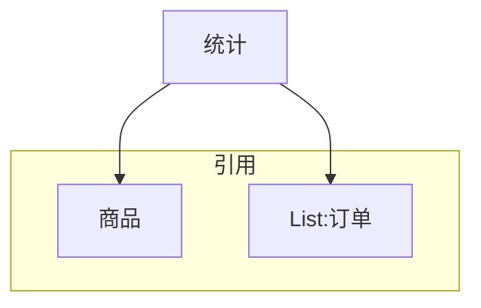
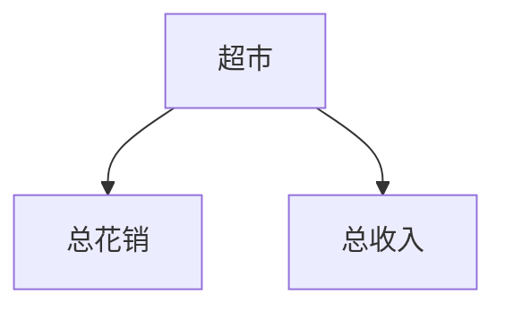
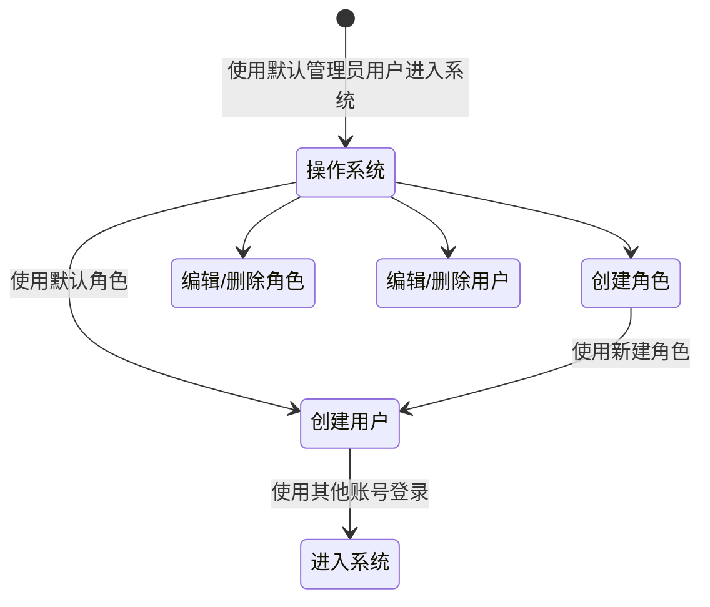
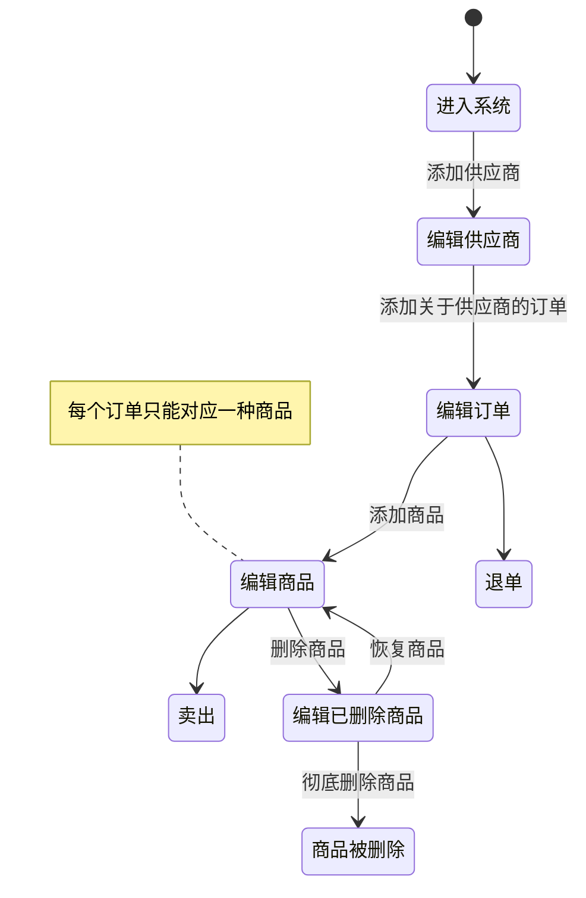

# 超市管理系统需求

## 商品管理

#### 商品操作

- 查询商品
  - 关键字查询
  - 目录查询
- 添加商品
- 删除商品
- 编辑商品
- 卖出商品

#### 库存管理

- 查询商品库存
  - 关键字查询
- 更改商品目前的库存

#### 订单管理

- 查询订单
  - 关键字查询
- 添加订单

#### 商品删除管理(管理已经被删除的商品)

- 查询已删除的商品
  - 关键字查询
- 恢复(从被删除状态恢复到正常状态)
- 删除已删除的商品？

## 销售管理

#### 退货管理

- 查询订单
  - 关键字查询
- 退货(撤销订单)

#### 销售统计

- 查询总计(将同种订单相加计算总计)
  - 关键字查询

## 基础资料管理

#### 供应商管理

- 查询供应商
  - 关键字查询
- 添加供应商
- 编辑供应商
- 删除供应商

#### 用户管理

- 查询用户
  - 关键字查询
- 添加用户
- 编辑用户
- 删除用户

#### 角色管理？

- 查询角色
  - 关键字查询
- 添加角色
- 授权编辑（授予角色进入***各种***管理的权限）
- 删除角色

# 实体类分析

## 角色

## 用户

## 供应商

## 订单

## 商品

## 统计

## 超市

# 流程分析

## 用户的一生：从出生到去世

## 商品的一生：从受精卵到去世

